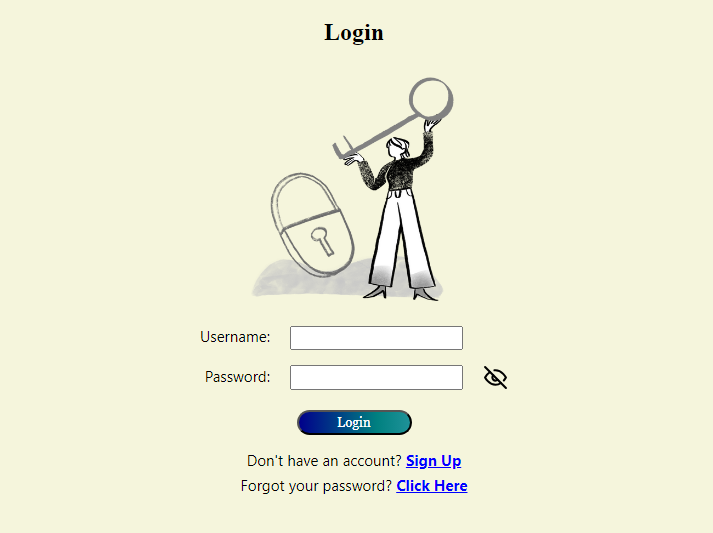
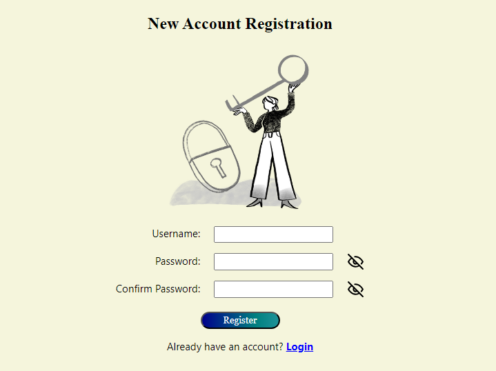
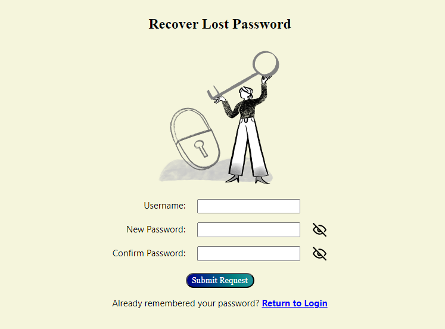

## Sigma School Module 1 - Authentication App Project

## Languages

## Installation/Setup
- Clone, fork or download the project as zip.
- Open up the "index.html" file on your browser.
- This projects does not utilize any back-end servers, and starts the session with no pre-registered users. Begin registering a new user to login!

## Preview

  
  

  

<!--- target = "_blank" not supported in GIT HTML Markdowns --->
<!--- Discussion: https://stackoverflow.com/questions/41915571/open-link-in-new-tab-with-github-markdown-using-target-blank --->

## License
MIT © [Leow Kean Tat/Project Kazcade](https://github.com/KTLeow93584)
